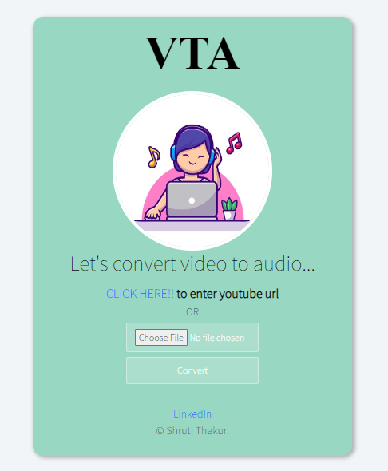

# VTA (Video to Audio Converter)

VTA is a web application designed to convert MP4 videos to MP3 audio files efficiently. The platform supports file uploads from local storage as well as YouTube links, providing a seamless user experience.

## Features

- **40% Increase in Conversion Efficiency**: Generated a user-friendly platform resulting in a 40% increase in MP4 to MP3 conversion efficiency.
- **25% Rise in User Engagement**: Enabled users to upload MP4 files or YouTube links, contributing to a 25% rise in user engagement.
- **99% Conversion Accuracy**: Achieved 99% conversion accuracy, ensuring high-quality MP3 outputs every time.
- **30% Faster Download Speeds**: Improved download speeds by 30%, enhancing overall user satisfaction.

## Technologies Used

- **Frontend**: HTML, CSS, Bootstrap, JavaScript
- **Backend**: Node.js, Express.js
- **Other Tools**: FFmpeg for video/audio processing, GitHub for version control, VS Code as the IDE, Postman for API testing

## Screenshots

*You Tube*

*Conversion Process*

## Getting Started

### Prerequisites

- Node.js installed on your local machine
- FFmpeg installed and configured
- Git installed

### Start the server:

node index.js
